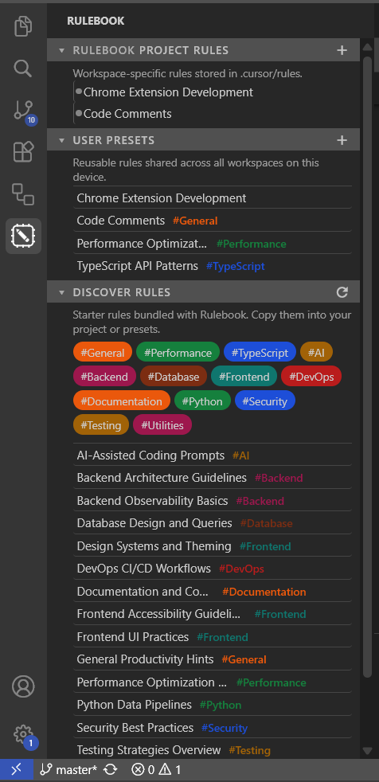
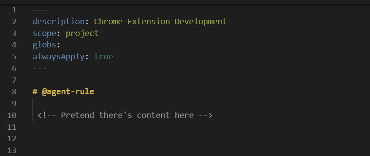
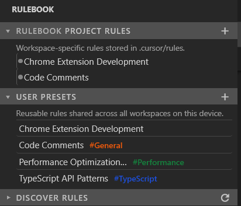

## Rulebook – System Instruction Manager

#### An IDE extension that streamlines using, editing, and discovering system instructions. Rulebook is simple but it elevates agent-assisted development to the next level.

<p align="center">
  <span style="font-weight: bold; font-size: 1.15em;"><i>It's not magic, it's markdown!</i></span>
  
</p>

- *Early Development (v0.0.9). Expect rapid changes, bugs, etc.*
- *github.com/jasonshaw0*

---

### What's Rulebook?

- **Convenient:** One icon in the activity bar opens a focused sidebar for all your system instructions—no more digging through nested settings UIs.
- **Direct:** Reads and writes to IDE-native rules directly-[VSCode placeholder], and `.cursor/rules/` in Cursor. Maintains the same MDC metadata you already rely on (`alwaysApply`, `description`, `glob`, `scope`, etc.).
- **Innovative:** Extends the native experience with:
  - Browsing every existing rule and opening it with a single click.
  - Creating new MDC rules with the correct header so they appear instantly in your editor's native rules UI.
  - Deleting rules you no longer need.
  - Saving rules as presets that persist across projects on your device, then adding saved presets to workspace with one click.
  - Reapplying saved presets back into the active project with one button.
  - Browsing a small built‑in catalog of effective rules and system instructions. Sorting with tags, and copying them into your project or presets lets you make custom edits.
  - Custom color-coded tags via a custom `tag:` metadata field. Easily organize and filter rules and presets for any use case.

### Status

- Very early development (v0.0.9).
- Currently implemented as a Cursor extension (installed via [`rulebook-agent-rule-manager-0.0.9.vsix`](./rulebook-agent-rule-manager-0.0.9.vsix)). 
- Planned upload to Open VSX Registry, VSCode support after that.

### Installation
**Install from prebuilt VSIX:** Open VSX Registry access is planned soon. Until then, you can install Rulebook from a prebuilt `.vsix` file.

1. Download prebuilt [`rulebook-agent-rule-manager-0.0.9.vsix`](./rulebook-agent-rule-manager-0.0.9.vsix).
2. Open your editor (Cursor) `Extensions → … → Install from VSIX…`.
3. Experience the best thing since sliced bread.

**Build from source:** If you want to contribute or test changes locally, you can build the `.vsix` from source locally.

```bash
npm install
npm run compile
vsce package
```
Then same steps as above. Feel free to contribute or modify as you please. 

*If making changes it's good practice to fully uninstall the extension, reload extensions, and then build a new file each time you update it.*


**Usage:** It's intuitive to use and I can't be bothered to make a guide.

### Screenshots







### License

MIT – see `LICENSE`.

Dont steal my icons brah!

